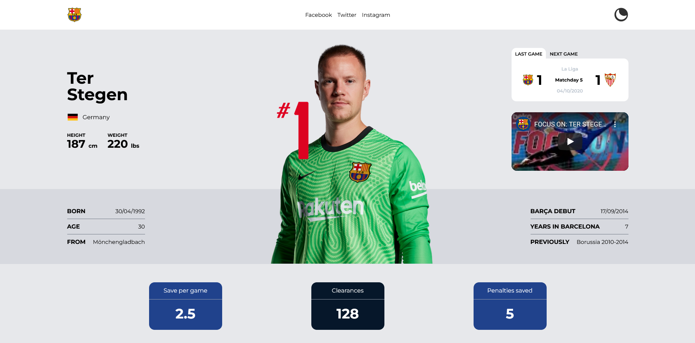
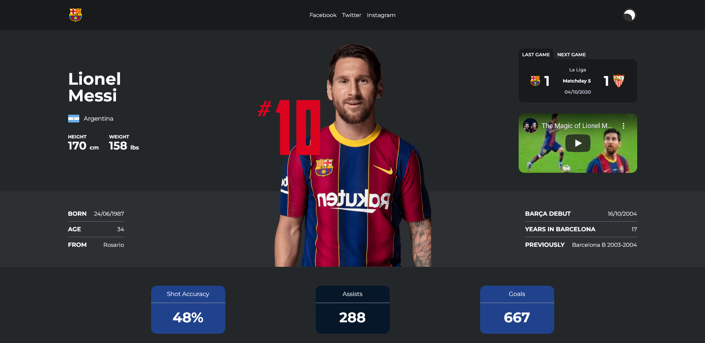

<p align="center">
   
</p>

# FC Barcelona

[](https://github.com/JuanGabriel2960)
[](#)

<p>
  <a href="#closedbook-about-the-project">About the project</a>&nbsp;&nbsp;&nbsp;|&nbsp;&nbsp;&nbsp;
  <a href="#constructionworker-installation">Installation</a>&nbsp;&nbsp;&nbsp;|&nbsp;&nbsp;&nbsp;
  <a href="#rocket-getting-started">Getting Started</a>&nbsp;&nbsp;&nbsp;|&nbsp;&nbsp;&nbsp;
  <a href="#hammer-built-with">Built with</a>&nbsp;&nbsp;&nbsp;
</p>

<br>
<p align="center">
  </p>
<p align="center">
  
</p>
<br>

# :closed_book: About the project

Web application responsible for displaying statistical and biographical information about the Barcelona football club squad, the app is fed by rest api built from strapi which makes it easy to edit the content and update it year after year.

# :construction_worker: Installation

**You need to install [Node.js](https://nodejs.org/en/download/) first, then in order to clone the project via HTTPS, run this command:**

```git clone https://github.com/JuanGabriel2960/fc-barcelona.git```

Or via SSH:

```git clone git@github.com:JuanGabriel2960/fc-barcelona.git```

**Install dependencies**

```npm install```

# :rocket: Getting Started

### `ng serve -o`

Runs the app automatically in the development mode.\
Open [http://localhost:4200](http://localhost:4200) to view it in the browser. The app will automatically reload if you change any of the source files.

### `ng build`

Run ng build to build the project. The build artifacts will be stored in the dist/ directory.

### `ng test`

Run ng test to execute the unit tests via Karma. [running tests](https://karma-runner.github.io).

### `ng e2e`

Run ng e2e to execute the end-to-end tests via a platform of your choice. To use this command, you need to first add a package that implements end-to-end testing capabilities.

# :hammer: Built With

- [Angular](https://angular.io/)
- [TypeScript](https://www.typescriptlang.org/)
- [NgRx](https://ngrx.io/)
- [Tailwind](https://tailwindcss.com/)